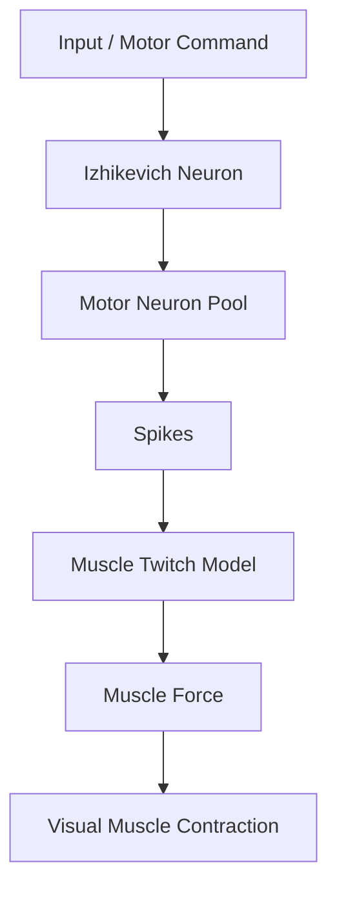
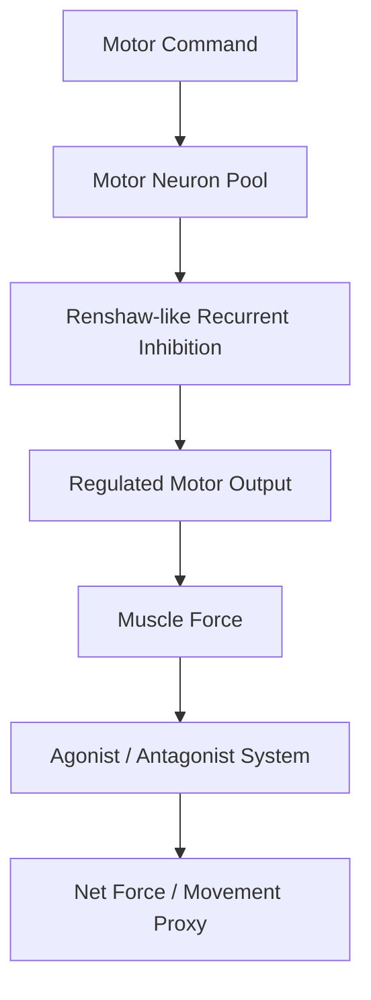

# Neural Network Exploration: Progressive Neuromotor Simulation with Izhikevich Neurons

## Descripción

Este proyecto propone una simulación neuronal progresiva usando el modelo de neurona spiking de Izhikevich. La aplicación conceptual está orientada al sistema motor: motoneuronas, pools neuronales, transformación de spikes en fuerza muscular simplificada, inhibición recurrente tipo Renshaw e inhibición recíproca entre sistemas agonista-antagonista.

El objetivo no es construir un modelo biológico completo, sino una maqueta computacional progresiva, visual e interpretable.

## Objetivo General

Construir una simulación progresiva que conecte dinámica neuronal spiking con una salida muscular simplificada.

## Objetivos Específicos

- Implementar una neurona Izhikevich individual.
- Explorar respuestas neuronales a distintos tipos de input.
- Simular un pool de motoneuronas idealizadas.
- Convertir spikes en una señal de fuerza muscular.
- Agregar inhibición recurrente tipo Renshaw.
- Agregar un sistema agonista-antagonista con inhibición recíproca.
- Crear una visualización simplificada de contracción muscular.

## Roadmap del Proyecto

- **Fase 1:** neurona individual Izhikevich.
- **Fase 2:** estímulos constantes, pulsos, rampas, ruido y señales sinusoidales.
- **Fase 3:** pool de motoneuronas.
- **Fase 4:** conversión de spikes a fuerza muscular.
- **Fase 5:** inhibición recurrente tipo Renshaw.
- **Fase 6:** sistema agonista-antagonista.
- **Fase 7:** visualización muscular simplificada.

## Flujo Principal



## Flujo Extendido



## Arquitectura

- `notebooks/`: notebooks Jupyter organizadas por fase del proyecto.
- `src/`: módulos Python reutilizables para neuronas, inputs, red, músculo, inhibición, métricas, visualización y configuración.
- `data/raw/`: datos crudos, si el proyecto incorpora datos externos.
- `data/processed/`: datos procesados o transformados.
- `data/simulations/`: resultados numéricos de simulaciones.
- `outputs/figures/`: figuras exportadas desde notebooks o scripts.
- `outputs/animations/`: animaciones de contracción muscular o demos visuales.
- `outputs/tables/`: tablas de métricas y resúmenes.
- `docs/`: documentación teórica, objetivos y referencias.
- `tests/`: pruebas básicas del scaffold y, más adelante, pruebas del comportamiento del modelo.

## Notebooks

- `01_single_izhikevich_neuron.ipynb`: neurona Izhikevich individual.
- `02_neuron_input_experiments.ipynb`: experimentos con distintos inputs.
- `03_motor_neuron_pool.ipynb`: pool de motoneuronas.
- `04_spikes_to_muscle_force.ipynb`: conversión spikes-fuerza.
- `05_recurrent_inhibition_renshaw.ipynb`: inhibición recurrente tipo Renshaw.
- `06_agonist_antagonist_system.ipynb`: agonista-antagonista e inhibición recíproca.
- `07_visual_muscle_demo.ipynb`: demo visual de contracción muscular.

## Instalación Inicial

```bash
python -m venv .venv
source .venv/bin/activate
pip install -r requirements.txt
python -m ipykernel install --user --name neural-network-exploration
```

## Referencias Iniciales

- Izhikevich, E. M. (2003). Simple Model of Spiking Neurons.
- Izhikevich, E. M. (2004). Which Model to Use for Cortical Spiking Neurons?
- Referencias futuras sobre circuitos motores espinales, inhibición recurrente y modelos neuromusculares.

## Estado del Proyecto

Early planning / project scaffold. La estructura está preparada para implementar el proyecto fase por fase.

