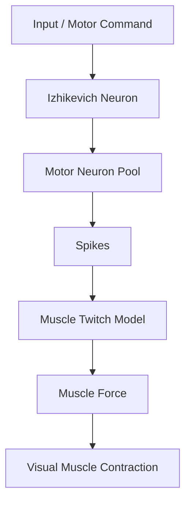
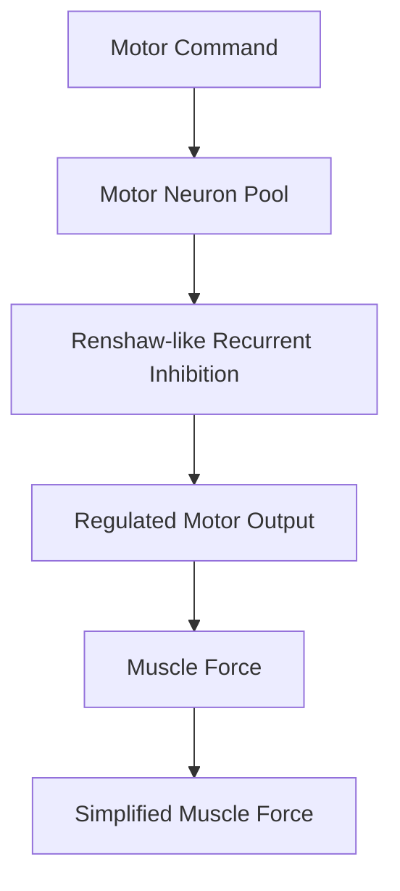

# Neural Network Exploration: Progressive Neuromotor Simulation with Izhikevich Neurons

## Descripción

Este proyecto propone una simulación neuronal progresiva usando el modelo de neurona spiking de Izhikevich. La aplicación conceptual está orientada al sistema motor: motoneuronas, pools neuronales, conectividad sináptica, inhibición recurrente tipo Renshaw y transformación de spikes en una fuerza muscular simplificada.

El objetivo no es construir un modelo biológico completo, sino una maqueta computacional progresiva, visual e interpretable.

## Objetivo General

Construir una simulación progresiva que conecte dinámica neuronal spiking con una salida muscular simplificada.

## Objetivos Específicos

- Implementar una neurona Izhikevich individual.
- Explorar respuestas neuronales a distintos tipos de input.
- Simular un pool de motoneuronas idealizadas.
- Convertir spikes en una señal de fuerza muscular.
- Agregar inhibición recurrente tipo Renshaw.
- Crear una visualización simplificada de contracción muscular.

## Roadmap del Proyecto

- **Fase 1:** neurona individual Izhikevich.
- **Fase 2:** estímulos constantes, pulsos, rampas, ruido y señales sinusoidales.
- **Fase 3:** pool de motoneuronas.
- **Fase 4:** inhibición recurrente tipo Renshaw.
- **Fase 5:** comparación controlada de intensidades inhibitorias.
- **Fase 6:** conversión de spikes a fuerza y visualización muscular simplificada.

## Flujo Principal



## Flujo Extendido



## Arquitectura

- `notebooks/`: notebooks Jupyter organizadas por fase del proyecto.
- `src/`: módulos Python reutilizables para neuronas, inputs, red, músculo, inhibición, métricas, visualización y configuración.
- `data/raw/`: datos crudos, si el proyecto incorpora datos externos.
- `data/processed/`: datos procesados o transformados.
- `data/simulations/`: resultados numéricos de simulaciones.
- `outputs/figures/`: figuras exportadas desde notebooks o scripts.
- `outputs/animations/`: animaciones de contracción muscular o demos visuales.
- `outputs/tables/`: tablas de métricas y resúmenes.
- `docs/`: documentación teórica, objetivos y referencias.
- `tests/`: pruebas rápidas de forma, reproducibilidad, convención de signos y conversión a fuerza.

## Notebooks

- `01_izhikevich_neuron.ipynb`: neurona individual y pool independiente con heterogeneidad.
- `02_neuron_interaction_W.ipynb`: red conectada mediante una matriz `W`.
- `03_recurrent_inhibition_renshaw.ipynb`: circuito MN–Renshaw y GUI interactiva.
- `04_renshaw_comparison_experiments.ipynb`: comparación de cuatro intensidades inhibitorias.
- `05_spikes_to_muscle_force.ipynb`: conversión spikes→twitches→fuerza y animación 2D.
- `06_project_summary.ipynb`: síntesis conceptual, resultados, conclusiones y limitaciones.

## Guía de lectura

Cada notebook contiene ahora una capa explicativa antes de los bloques técnicos. La lectura recomendada es secuencial:

```text
01. dinámica individual y significado de la semilla
                 ↓
02. matriz W y corriente sináptica
                 ↓
03. flujo MN → Renshaw → inhibición → MN
                 ↓
04. métricas y comparación experimental controlada
                 ↓
05. spikes → kernel twitch → convolución → fuerza
                 ↓
06. interpretación integrada y límites
```

### Semilla aleatoria

La semilla fija la secuencia pseudoaleatoria usada para ruido, heterogeneidad y conexiones. No representa una propiedad biológica. Repetir parámetros y semilla produce exactamente la misma realización; usar varias semillas permite evaluar si una tendencia es robusta.

### Convención de matrices

Las filas son neuronas de origen y las columnas neuronas de destino. En el circuito Renshaw ambas matrices almacenan magnitudes positivas:

- `W_MN_to_R[i,j]`: excitación desde la motoneurona `i` hacia la Renshaw `j`.
- `W_R_to_MN[k,i]`: magnitud inhibitoria desde la Renshaw `k` hacia la motoneurona `i`; se resta explícitamente del input motor.

### Alcance de la fuerza

La fuerza se obtiene convolucionando los impulsos de spikes con un kernel twitch de subida rápida y relajación lenta. Se expresa en unidades arbitrarias y funciona como proxy de activación, no como fuerza biomecánica validada.

## Instalación Inicial

```bash
/usr/local/bin/python3 -m venv .venv
source .venv/bin/activate
python -m pip install --upgrade pip setuptools wheel
pip install -r requirements.txt
python -m ipykernel install --user --name neural-network-exploration --display-name "Python (Neural Network Exploration)"
```

En Jupyter o VS Code, seleccionar el kernel `Python (Neural Network Exploration)`.

## Referencias Iniciales

- Izhikevich, E. M. (2003). Simple Model of Spiking Neurons.
- Izhikevich, E. M. (2004). Which Model to Use for Cortical Spiking Neurons?
- Modeling spinal locomotor circuits for movements in developing zebrafish. Yann Roussel
- Modeling and Identification of a Realistic Spiking
Neural Network and Musculoskeletal Model of the
Human Arm, and an Application to the Stretch Reflex.
Manish Sreenivasa
