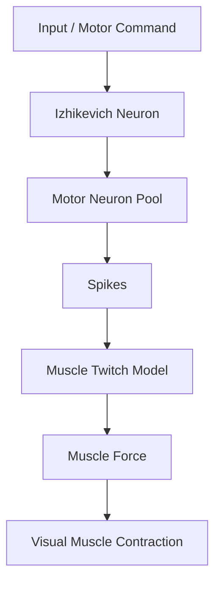
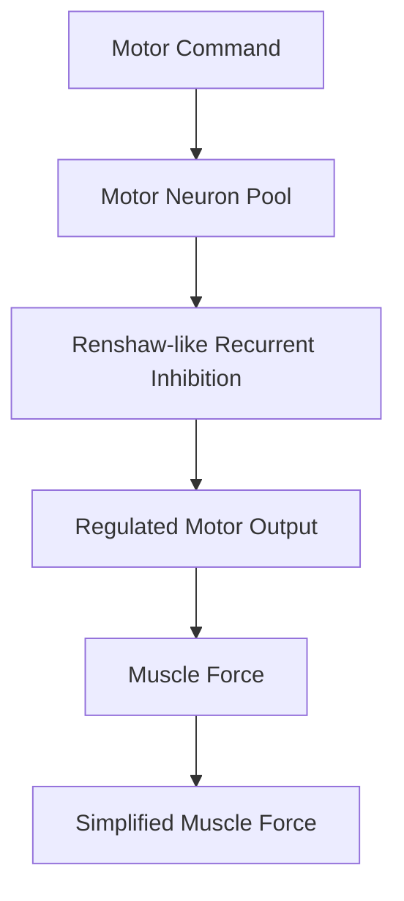

# Project Flow

Este archivo resume el pipeline conceptual del proyecto y sirve como guía rápida para conectar las fases de implementación.

## Flujo Principal

## Flujo Extendido

## Lectura por Fases

- **Fase 1:** una neurona Izhikevich permite validar la dinámica spiking básica.
- **Fase 2:** distintos inputs permiten estudiar sensibilidad y patrones de disparo.
- **Fase 3:** un pool motor introduce actividad poblacional.
- **Fase 4:** una matriz de conectividad introduce corriente sináptica.
- **Fase 5:** la inhibición recurrente tipo Renshaw regula la salida motora.
- **Fase 6:** escenarios controlados comparan distintas magnitudes inhibitorias.
- **Fase 7:** los spikes se transforman en fuerza y una visualización contráctil interpretable.
